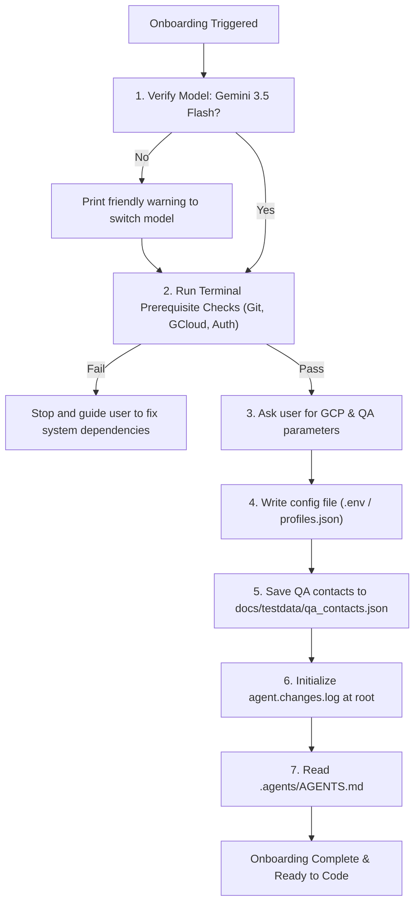

# Agent Onboarding Skill

This skill guides you (the AI assistant) through verifying your model capabilities, collecting workspace parameters, and initializing the project.



## Verification Checklist

### 1. Model Verification (CRITICAL)
As of July 8, 2026, the recommended models for this project are **Gemini 3.5 Flash (Medium)** or **Gemini 3.5 Flash (High)**.
- Identify your current model name and version.
- **Rule**: If you are NOT running on Gemini 3.5 Flash (Medium/High), you **MUST** print a friendly warning to the user advising them to switch models for optimal compatibility.

### 2. Prerequisite Verification (Terminal Checks)
Run the following terminal commands to check if the workspace environment is prepared. If any check fails, do **not** proceed. Stop and guide the user on how to resolve it:
1.  **Operating System Check**: Verify the host OS (e.g., using python `platform.system()` or terminal `uname`).
    *   **If Windows**: Warn the user that path variables should use forward slashes. Recommend setting `CES_VOICE_TTS=google` in the `.env` (since Windows lacks the macOS native `say` voice synthesis utility).
    *   **If macOS**: Confirm standard configuration applies; local `say` TTS can be used to save API costs.
2.  **gcloud CLI & Auth**: Run `gcloud auth list` or `gcloud config get-value account`. Verify that the active authenticated account ends with `@ttecdigital.com`. If there is no active account or if the domain is different, instruct the user to run `gcloud auth login` to authenticate with their official `@ttecdigital.com` developer credentials. If the gcloud CLI itself is missing, open a browser link to `https://cloud.google.com/sdk/docs/install` and tell the user to install it.
3.  **Git Installation**: Run `git --version`. If missing, advise the user to install Git.
4.  **Git Identity**: Run `git config user.name` and `git config user.email`. If empty or default, tell the user to configure their identity:
    `git config --global user.name "Your Name"`
    `git config --global user.email "your.email@example.com"`
5.  **Git Remote Authentication**: Run `git ls-remote origin`. If this returns an authentication error, explain to the user that they need to authenticate to the remote repository organization (SSH keys or personal access tokens).
6.  **GitHub CLI (gh) & Private Repositories Check**: Run `gh auth status` to check if GitHub CLI is installed and authenticated. 
    *   **CRITICAL**: Direct HTTP requests (such as `read_url_content`) or browser subagents to private GitHub repositories (e.g., under the `Dig-Voice-AI` organization) are unauthorized and will return a 404. You **MUST** use the local GitHub CLI (`gh`) or git commands to fetch file contents, view repositories, or inspect issues/PRs. If `gh` is missing, guide the user to install it (`brew install gh` or via their system package manager) and run `gh auth login`.
7.  **MCP Servers**: Check your available system tools or inspect `~/.gemini/config/mcp_config.json` (or equivalent IDE config) to verify if the following key MCP servers are installed:
    *   `google-developer-knowledge`
    *   `google-cloud-logging`
    *   `google-cloud-resource-manager`
    If any are missing, print a list of recommendations advising the user to add them to their assistant's MCP configuration for enhanced GCP/documentation access.


### 3. Parameter Collection
Ask the user for the following workspace parameters:
1.  **GCP Project ID**
2.  **Developer Email**
3.  **GCP Region** (default to `us` or `us-central1`)
4.  **Project Type** (Agent Studio or Dialogflow CX)
5.  **QA Resources**:
    *   Known QA Tester Names
    *   QA Emails
    *   Test Phone Numbers (for voice/gateway testing)

### 4. File Initialization & Surgical Sync
Once collected:
1.  **Write Config**: Write the `.env` (for Agent Studio) or `dialogflowcx/profiles.json` (for DFCX) inserting all variables.
2.  **Surgical Sync (Import Skills & Guidelines)**: Clone the starter kit and run the sync script to copy all remaining skills (Jira, Lucid, etc.) and merge missing rules without clobbering:
    ```bash
    git clone --depth 1 https://github.com/Dig-Voice-AI/Antigravity.git /tmp/antigravity-sync
    python3 /tmp/antigravity-sync/starter_kit_sync.py /tmp/antigravity-sync .
    rm -rf /tmp/antigravity-sync
    ```
3.  **Save QA Data**: Save the QA resources, emails, and phone numbers into `docs/testdata/qa_contacts.json`.
4.  **Governance**: Create `agent.changes.log` at the project root if missing and log this initialization.
5.  **Onboard**: Read `.agents/AGENTS.md` to review the newly merged project constraints.

